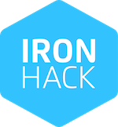

# Chat App on Node.js



Evento promovido e realizado pela Ironhack no dia 23/04/2020.

O objetivo era apresentar um simples web chat baseado em socket.io e Node.js

## Tech Stack
- [Node.js](https://nodejs.org/en/download/) - JavaScript runtime Server
- [Express.js](https://expressjs.com/) - Web framework
- [HandleBars](https://handlebarsjs.com/) - View Engine
- [Socke.io](https://handlebarsjs.com/) - Real Time Engine based on WebSockets
- [Bulma](https://bulma.io/) - CSS framework.

## Comandos

```
$ npm install
$ npm start
$ open http://localhost:3000/
```

Abra duas abas no navegador para obter a funcionalidade de um chat [http://localhost:3000](http://localhost:3000).


